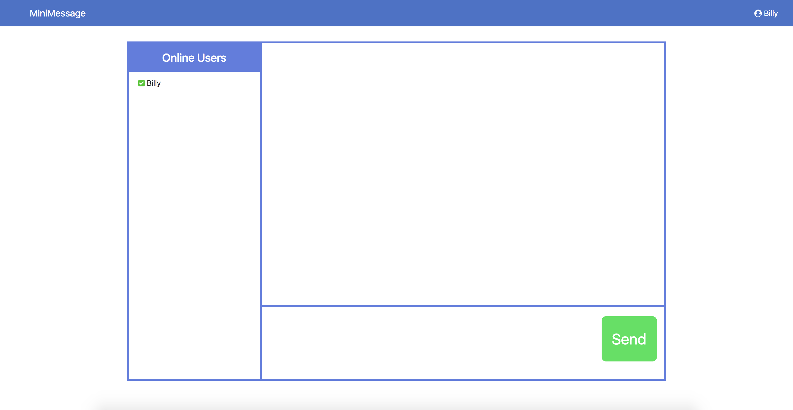
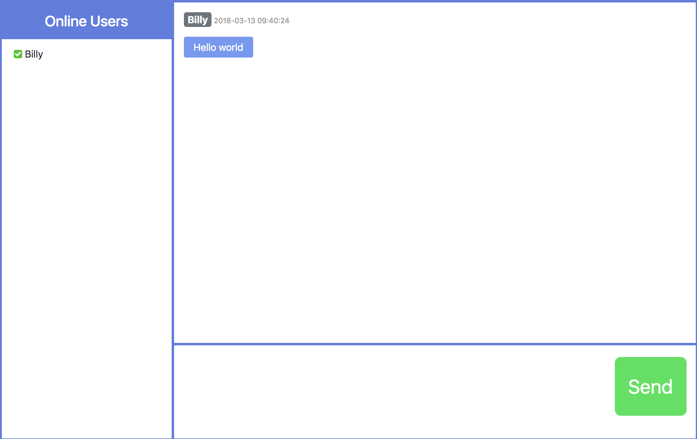

# MiniMessage
A web chat room application. Developed with Flask framework, jQuery 3 and Bootstrap 4.
一个在线网页聊天室，使用 Flask 框架、jQuery 3 和 Bootstrap 4 开发。

Visit [mime.billyzou.com](http://mime.billyzou.com/) to try it! (Not avaiable currently)

## Login 登录

Enter your user name when you open the webpage.
当你打开页面时，输入用户名。

## Chat 聊天

Online users are displayed on the left side. Messages are displayed on the top-right side and input area is on the bottom-right side.

左边是在线用户列表，右上方显示聊天信息，右下方为输入框。